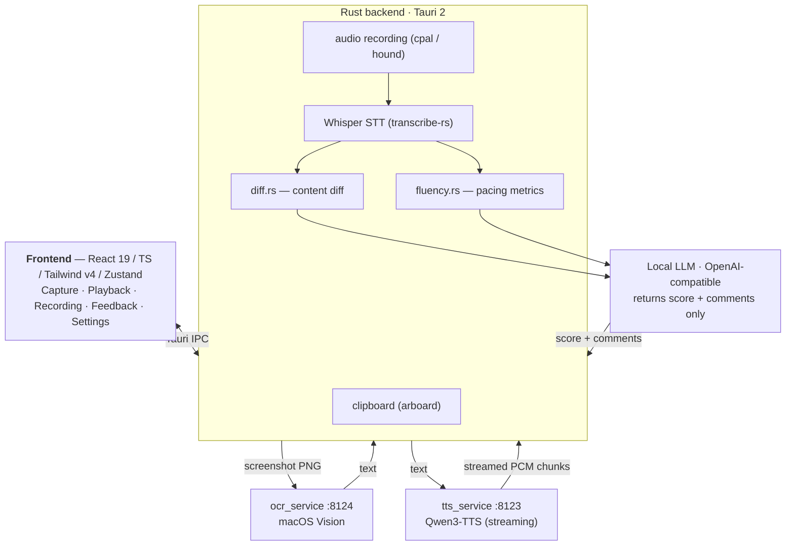

# azReadAnalyzer

> A **100% on-device** macOS app for English speaking practice — capture text, listen, read it aloud, and get instant feedback. No audio or text ever leaves your machine.

-black)


azReadAnalyzer is a personal project: a desktop tool that helps English learners (built with Chinese-native speakers in mind) practice reading aloud. You grab a passage — from a screenshot or the clipboard — listen to a natural-sounding model read it, record yourself reading the same text, and get feedback on **how accurately and fluently** you read it. Everything runs locally: OCR, speech synthesis, transcription, and analysis all happen on-device, and the optional feedback LLM is a local server too.

> _Screenshot coming soon._ <!-- Drop a PNG at docs/screenshot.png and uncomment:  -->

## Features

- **Capture text** — grab a passage by interactive **screenshot** (macOS Vision OCR) or straight from the **clipboard**, with a thumbnail + lightbox preview.
- **Listen** — true **streaming TTS** (first sound in ~0.2–0.3s regardless of length) with **0.75×–2×** speed control, pause/resume, and a progress bar.
- **Record yourself** — one-tap recording with a live audio level meter and timer.
- **Get feedback** — a word-level **content diff** (what you added / dropped / misread) plus **pacing metrics** (words per minute, articulation rate, pauses, hesitations), with an optional **local-LLM score and comments** layered on top.
- **Settings** — configure the local LLM connection (base URL, model, key, timeout) and tune the app's frosted-glass appearance.
- **Frosted-glass UI** — custom titlebar, always-on-top, on a translucent indigo theme.

## How it works

```
React 19 / TS / Tailwind v4 / Zustand  ──Tauri IPC──►  Rust backend
                                                         ├─ clipboard (arboard)
                                                         ├─ audio recording (cpal / hound)
                                                         ├─ Whisper STT (transcribe-rs, word timestamps)
                                                         ├─ diff.rs    (deterministic content diff)
                                                         └─ fluency.rs (pacing metrics)
                                                              │
              Python sidecars (HTTP)                    Local LLM (OpenAI-compatible)
              ├─ ocr_service  :8124 (macOS Vision)      └─ returns SCORE + COMMENTS only
              └─ tts_service  :8123 (Qwen3-TTS, streaming)
```



A few design decisions are load-bearing — they're deliberate, not accidental:

1. **Feedback is content + fluency, not phoneme-level pronunciation.** Whisper's language model auto-corrects dropped word-endings, so a transcript diff can't reliably detect mispronunciation. v1 focuses on what *can* be measured honestly; phoneme-level scoring is deferred.
2. **The diff and metrics are deterministic and Rust-owned.** [`diff.rs`](src-tauri/src/diff.rs) (word-level content diff) and [`fluency.rs`](src-tauri/src/fluency.rs) (pacing from Whisper word timestamps) are unit-tested. The LLM only receives the already-computed diff + pacing and returns `{score, comments}` — which is what makes the feedback testable.
3. **The LLM is best-effort.** If the local LLM is unreachable, the app still shows the locally-computed diff and pacing; the score is simply `null`.
4. **Streaming TTS flows through Rust.** Audio chunks stream sidecar → Rust → frontend over a Tauri `Channel`, then schedule gaplessly through the Web Audio API.

See [the design spec](docs/superpowers/specs/2026-06-07-azreadanalyzer-design.md) for the full rationale.

## Tech stack

| Layer | Technologies |
|-------|--------------|
| **Frontend** | React 19, TypeScript, Tailwind CSS v4, Zustand 5, Vite 8, react-resizable-panels |
| **Backend** | Rust, Tauri 2.10, tokio, cpal + hound (audio), rubato (resampling), transcribe-rs / whisper-cpp + Metal (STT), similar (diff), reqwest |
| **Sidecars** | Python + FastAPI — TTS `:8123` (Qwen3-TTS via MLX-Audio, streaming), OCR `:8124` (macOS Vision) |
| **LLM** | Local, OpenAI-compatible endpoint (optional) |

## Getting started

**Prerequisites:** macOS on Apple Silicon · Node 18+ · Rust (stable) · Python 3.11/3.12 · Xcode Command Line Tools.

The app needs two Python sidecars, a Whisper model, and (optionally) a local LLM running. Once those are up, launch the app:

```bash
npx tauri dev
```

👉 **See [SETUP.md](SETUP.md) for the complete setup guide** — starting the TTS/OCR sidecars, downloading the Whisper model, configuring the LLM environment variables, and granting macOS Microphone + Screen-Recording permissions.

## Project structure

```
azReadAnalyzer/
├─ src/                  React frontend
│  ├─ components/        Capture, Playback, Recording, Feedback, Settings panels
│  ├─ lib/               streamPlayer (Web Audio), frost, helpers
│  └─ store/             Zustand store
├─ src-tauri/src/        Rust backend
│  ├─ commands.rs        Tauri IPC commands
│  ├─ diff.rs            deterministic content diff
│  ├─ fluency.rs         pacing metrics
│  ├─ stt.rs             Whisper transcription
│  └─ llm.rs             local-LLM client
├─ tts_service/          Python TTS sidecar (:8123)
├─ ocr_service/          Python OCR sidecar (:8124)
└─ docs/                 design specs, plans, and reviews
```

## Development

```bash
# Frontend
npm run dev            # vite only (UI dev)
npm test               # vitest
npm run lint           # eslint
npx tsc -b             # typecheck
npm run build          # tsc -b && vite build

# Rust (from src-tauri/)
cargo test --lib       # unit tests (diff.rs, fluency.rs, streaming, ...)

# Full app build
npx tauri build
```

UI-only development without the Rust backend or sidecars is supported via mock mode (`VITE_USE_MOCK=true npm run dev`).

## Design docs

This project was built spec-first; the `docs/` tree captures the whole process:

- **[Specs](docs/superpowers/specs/)** — the authoritative [design](docs/superpowers/specs/2026-06-07-azreadanalyzer-design.md), [Tier-B hardening](docs/superpowers/specs/2026-06-08-azreadanalyzer-tierb-hardening.md), and [streaming TTS](docs/superpowers/specs/2026-06-11-streaming-tts-design.md).
- **[Plans](docs/superpowers/plans/)** — the task-by-task implementation plans.
- **[PM reviews](docs/pmreview/)** & **[third-party reviews](docs/thirdpartyreview/)** — per-iteration reviews and the engineering responses.

## Project status

**MVP built and Tier-B hardened.** The full stack compiles and the unit tests pass: `cargo test --lib`, frontend `vitest`, `tsc`, `eslint`, and `vite build` are all clean, and the Practice/Feedback UI renders correctly in mock mode.

The one thing that can only be verified on the target Mac is a real microphone → TTS → LLM round-trip — that needs Microphone + Screen-Recording permissions, the Whisper model, both sidecars, and a local LLM. The pipeline is wired and unit-tested per stage; the live end-to-end pass runs on the hardware.

## Acknowledgements

This app reuses approaches from two sibling projects of mine:

- **STT** follows **MeetBuddy** (`transcribe-rs` + whisper-cpp, `ggml-base.en.bin`).
- The **TTS sidecar** and the **visual theme** (dark frosted glass, indigo accent, Inter) come from **azVoiceAssist**.

## License

[MIT](LICENSE) © 2026 Allen (yaominzh)
