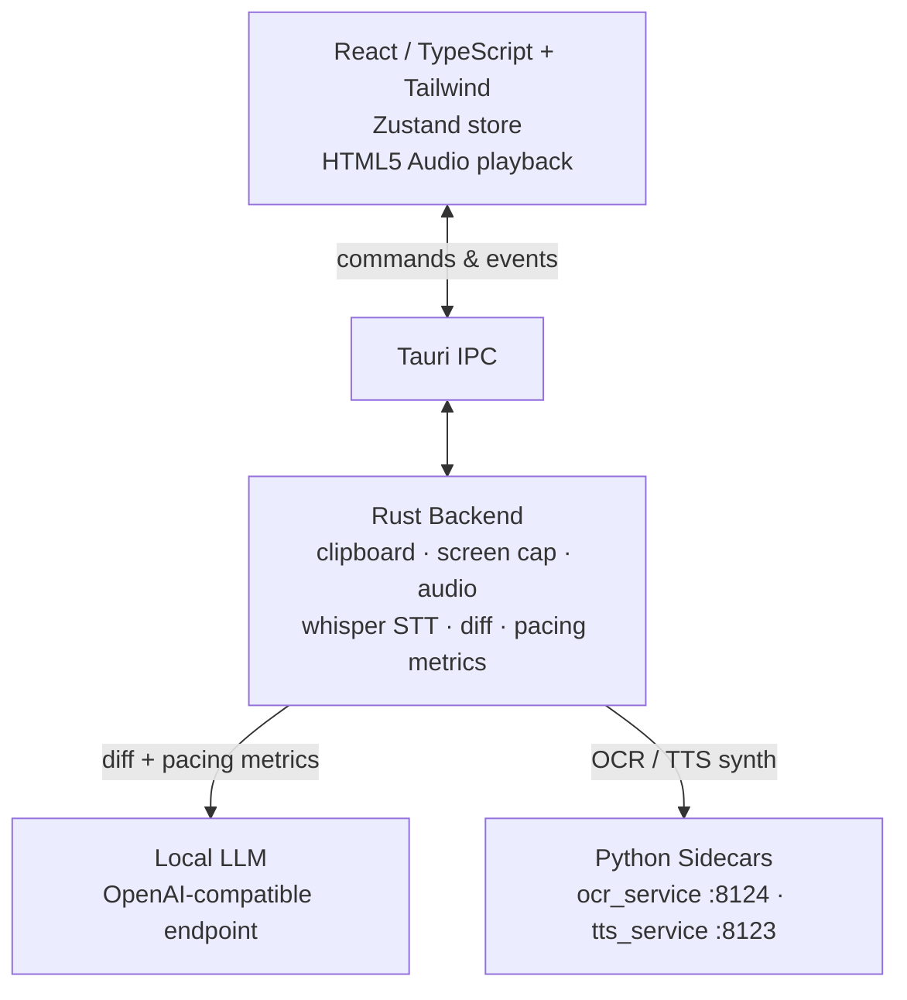
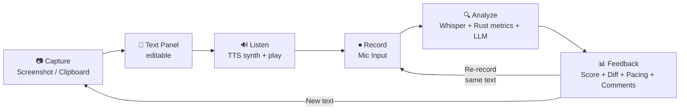
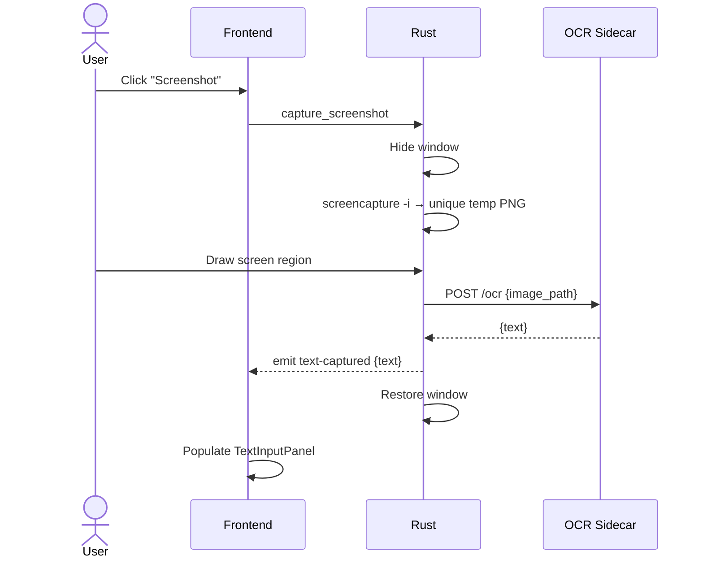
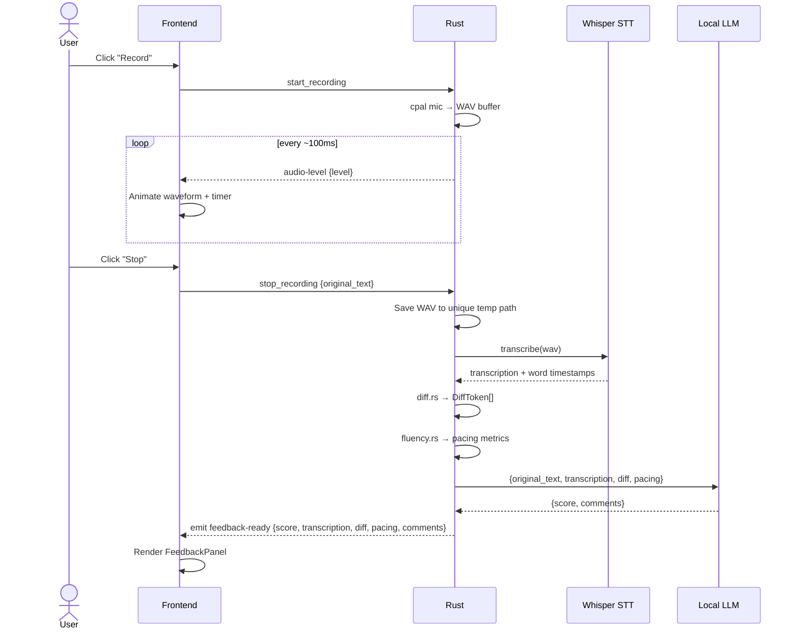

# azReadAnalyzer — Design Spec

**Date:** 2026-06-07  
**Status:** Approved

---

## Overview

azReadAnalyzer is a macOS desktop app for English speaking practice. The user captures text (via screenshot OCR or clipboard paste), listens to it read aloud by TTS, records themselves reading it, and receives AI-powered feedback on **content accuracy** (which words were said, missed, or substituted) and **fluency/pacing** (speech rate, pauses, hesitations) derived from the recording.

**Target user:** Chinese native speaker practicing English fluency — speaking rate, pausing, hesitation, and content accuracy.

> **Scope note (v1):** Feedback is positioned as **content accuracy + fluency/pacing**, not phoneme-level pronunciation. This is a deliberate, research-grounded decision — see [Feedback Methodology](#feedback-methodology--research-basis). Phoneme-level pronunciation / dropped-word-ending detection (e.g. catching a dropped `-ed`/`-ly`) requires acoustic Goodness-of-Pronunciation (GOP) + forced alignment, which is **deferred to v2** (see Out of Scope).

**Use cases:** Language learning, presentation rehearsal, reading fluency practice.

**Privacy:** 100% on-device. No audio or text leaves the machine.

---

## Architecture

**Stack:** Tauri 2 (same as MeetBuddy) — Rust backend + React/TypeScript frontend.

```
┌─────────────────────────────────────────────────────────────┐
│  Tauri 2 App Window (always-on-top, resizable)              │
│                                                             │
│  React/TypeScript + Tailwind (azVoiceAssist color theme)    │
│  Zustand store  ←→  Tauri IPC  ←→  Rust backend             │
└─────────────────────────────────────────────────────────────┘
         │                              │
         │                     ┌────────┴────────┐
         │                     │   Rust modules  │
         │                     │  • clipboard    │
         │                     │  • screen cap   │
         │                     │  • audio (cpal) │
         │                     │  • whisper STT  │
         │                     └────────┬────────┘
         │                              │
    ┌────┴────┐                ┌────────┴────────┐
    │  Local  │                │  Python sidecars│
    │  LLM    │                │  • ocr_service  │
    │  (OAI-  │                │  • tts_service  │
    │  compat)│                │  (Qwen3-TTS)    │
    └─────────┘                └─────────────────┘
```



### Sidecars

| Sidecar | Language | Purpose |
|---------|----------|---------|
| `tts_service/` | Python | Qwen3-TTS — **synthesizes** a full WAV from `{text}` (reused from azVoiceAssist verbatim). Playback, pause, speed, and progress are handled **client-side** (see note below). |
| `ocr_service/` | Python | macOS Vision framework via PyObjC — OCR on screenshots |

> **TTS reuse boundary:** The azVoiceAssist `tts_service` accepts only `{text}` and returns a complete WAV buffer — it does **not** stream, play, or accept a speed parameter. azVoiceAssist plays audio Rust-side via `rodio` (stop-only, no pause/position). azReadAnalyzer does **not** reuse that playback path. Instead, Rust returns the WAV bytes to the frontend, and the React `PlaybackControls` component plays them with the HTML5 `Audio` element — which provides play/pause, `playbackRate` (speed 0.75x–2x), and `currentTime`/`duration` (progress) natively. So "reuse" covers synthesis only; playback/speed/progress is net-new frontend work.

### Local LLM
OpenAI-compatible endpoint (same env vars as azVoiceAssist: `OMLX_BASE_URL`, `OMLX_API_KEY`, `OMLX_MODEL`). The LLM receives the **Rust-computed** content diff and pacing metrics (not raw audio) and returns a **score + coaching comments only** — it does not compute the diff. See [Feedback Methodology](#feedback-methodology--research-basis).

---

## Core User Flow

```
1. CAPTURE   Screenshot region (OCR) OR paste clipboard → editable text panel
2. LISTEN    Click "Read Aloud" → TTS synthesizes WAV → frontend plays at selected speed (0.75x–2x)
3. RECORD    Click "Record" → mic captures user reading → waveform + timer shown
4. ANALYZE   Stop recording → Whisper transcribes (with word timestamps) →
             Rust computes content diff + pacing metrics → LLM produces score + comments
5. FEEDBACK  Diff view + pacing metrics + fluency score (0–100) + LLM coaching comments
6. REPEAT    Re-record same text OR capture new text
```



Each session is one **practice round**. The user can re-record the same text as many times as they want before moving to new content.

---

## UI Layout

Two-panel split (50/50, resizable):

```
┌─────────────────────────────────────────────────────────────────┐
│  [● ● ●]           azReadAnalyzer          [Always on top  ●]   │
├──────────────────────────────┬──────────────────────────────────┤
│  TEXT INPUT                  │  LISTEN                          │
│  ┌──────────────────────┐   │  [▶]  ████░░░░░░░  0:14/0:42 1x  │
│  │  (editable text)     │   ├──────────────────────────────────┤
│  │                      │   │  RECORD YOUR READING             │
│  └──────────────────────┘   │  [⏺]  ~~~~waveform~~~~  00:23   │
│  [Screenshot] [Paste] [Edit] ├──────────────────────────────────┤
│                              │  FEEDBACK                   [87] │
│                              │  Pacing: 142 wpm · 6 pauses ·    │
│                              │          2 long hesitations      │
│                              │  original vs yours (diff)        │
│                              │  • missed  • said instead        │
│                              │  LLM coaching comments           │
│                              │  [Re-record]  [New Text]         │
└──────────────────────────────┴──────────────────────────────────┘
```

**Styling:** azVoiceAssist aesthetic — `#080808` background, frosted glass panels (`backdrop-blur`), indigo accent (`#6366f1` / `#818cf8`), Inter font. Always-on-top toggle in titlebar. Resizable, draggable window.

**Screenshot capture UX:** clicking "Screenshot" hides/minimizes the window → user draws a region using macOS native screenshot tool (`screencapture -i`) → window restores → OCR sidecar extracts text → text populates the input panel.

---

## Components

### Frontend (`src/`)

| Component | Purpose |
|-----------|---------|
| `TextInputPanel` | Editable textarea showing captured/pasted text |
| `CaptureControls` | Screenshot, Paste, Edit buttons |
| `PlaybackControls` | Plays TTS WAV via HTML5 `Audio` — play/pause/stop, progress bar (`currentTime`/`duration`), speed selector (`playbackRate`, 0.75x–2x) |
| `RecordingPanel` | Record/stop button, animated waveform, timer |
| `FeedbackPanel` | Score ring, content-diff view, pacing-metrics readout, LLM comment list, Re-record/New Text buttons |
| `useAppStore` | Zustand store — all app state |
| `useTauriEvents` | Wires Tauri IPC events to store actions |

### Rust backend (`src-tauri/src/`)

| Module | Purpose |
|--------|---------|
| `capture.rs` | Screen region selection + screencapture subprocess + temp image file; HTTP calls to OCR and TTS sidecars |
| `clipboard.rs` | Read clipboard text via `arboard` crate |
| `audio.rs` | Mic recording via `cpal` + WAV file output |
| `stt.rs` | Whisper STT on user's recording via `transcribe-rs` (same as MeetBuddy); returns transcription text **plus word/segment timestamps** for pacing analysis |
| `diff.rs` | **Deterministic** word-level diff (token alignment over original vs transcription) → `DiffToken[]`. Owned by Rust, unit-tested. |
| `fluency.rs` | Computes pacing metrics from word timestamps: words-per-minute, articulation rate, pause count, total pause duration, pause ratio, long-hesitation count. Unit-tested with synthetic timestamps. |
| `llm.rs` | HTTP call to local LLM — sends the Rust-computed diff + pacing metrics, receives **score + coaching comments only** |
| `commands.rs` | Tauri IPC commands (capture, paste, play, record, stop, analyze) |
| `events.rs` | Typed events emitted to frontend |

### Python sidecars

**`ocr_service/`**
- Transport: HTTP (FastAPI on :8124), `POST /ocr {image_path}` → `{text}`
- Input: image file path (temp PNG from screencapture)
- Uses: `pyobjc-framework-Vision` for macOS Vision OCR
- Output: extracted text string as JSON

**`tts_service/`** (reused from azVoiceAssist **verbatim** — no changes)
- Transport: HTTP (FastAPI on :8123), `POST /tts {text}` → WAV bytes
- Input: `{text}` only (no speed parameter — speed is applied client-side via HTML5 `Audio.playbackRate`)
- Output: a complete WAV buffer (audio/wav). Does **not** play audio — Rust returns the bytes to the frontend, which plays them.

---

## Data Flow

### Screenshot → Text
```
User clicks "Screenshot"
  → Tauri hides window
  → Rust spawns: screencapture -i <unique-temp>.png
  → User draws region
  → Rust sends image path to OCR sidecar (HTTP POST)
  → OCR sidecar returns extracted text
  → Tauri emits text-captured event → frontend populates TextInputPanel
  → Rust deletes the temp image; Tauri restores window
```

> **Temp files:** Both the screenshot PNG and the recording WAV use **unique** temp paths (e.g. via the `tempfile` crate or a UUID suffix) and are deleted after use — avoids collisions across concurrent instances and stale-file buildup.



### Record → Feedback
```
User clicks "Record"
  → Rust starts cpal mic capture → streams to WAV buffer
  → Frontend shows waveform (audio-level events) + timer
User clicks "Stop"
  → Rust saves WAV file to a unique temp path
  → Rust runs Whisper STT → transcription string + word timestamps
  → Rust computes content diff (diff.rs) — deterministic, unit-tested
  → Rust computes pacing metrics (fluency.rs) from word timestamps
  → Rust calls local LLM with {original_text, transcription, diff, pacing}
       → LLM returns {score, comments} ONLY (diff + pacing already computed in Rust)
  → Tauri emits feedback-ready {score, transcription, diff, pacing, comments}
  → FeedbackPanel renders
```



---

## Tauri IPC Contract

### Commands (frontend → Rust)
| Command | Args | Returns |
|---------|------|---------|
| `capture_screenshot` | — | — (emits `text-captured`) |
| `paste_clipboard` | — | `string` (clipboard text) |
| `play_tts` | `{text}` | `number[]` (WAV bytes; frontend plays via HTML5 Audio) |
| `start_recording` | — | — (emits `recording-state`) |
| `stop_recording` | `{originalText}` | — (emits `feedback-ready`) |

> No `stop_tts` command — playback is fully client-side (HTML5 `Audio.pause()`).

### Events (Rust → frontend)
| Event | Payload |
|-------|---------|
| `text-captured` | `{text: string}` |
| `audio-level` | `{level: number}` — for waveform |
| `recording-state` | `{state: "idle" \| "recording" \| "analyzing"}` |
| `feedback-ready` | `{score, transcription, diff, pacing, comments}` |

> No `tts-state` event — TTS playback state (playing/paused, position, duration) lives entirely in the frontend via the HTML5 `Audio` element, not in Rust.

---

## State (Zustand)

```typescript
interface AppState {
  // Text
  inputText: string;
  // TTS (playback state lives in the component via HTML5 Audio; only speed is global)
  ttsState: 'idle' | 'playing';
  ttsSpeed: number;          // 0.75 | 1.0 | 1.25 | 1.5 | 2.0
  // Recording
  recordingState: 'idle' | 'recording' | 'analyzing';
  audioLevel: number;
  recordingTimer: number;
  // Feedback
  feedback: FeedbackResult | null;
}

interface FeedbackResult {
  score: number;             // 0-100, from LLM
  transcription: string;
  diff: DiffToken[];         // computed in Rust (diff.rs)
  pacing: PacingMetrics;     // computed in Rust (fluency.rs)
  comments: LlmComment[];    // from LLM
}

interface DiffToken {
  text: string;
  type: 'correct' | 'missed' | 'added';  // missed = in original, not said; added = said, not in original
}

interface PacingMetrics {
  wordsPerMinute: number;
  articulationRate: number;  // words/min excluding pause time
  pauseCount: number;
  totalPauseMs: number;
  pauseRatio: number;        // pause time / total time
  longHesitations: number;   // pauses exceeding the hesitation threshold
}

interface LlmComment {
  icon: string;              // a single emoji, returned by the LLM (prompt instructs emoji-only)
  text: string;
}
```

---

## Feedback Methodology & Research Basis

This section documents *why* v1 feedback is scoped to **content accuracy + fluency/pacing** rather than phoneme-level pronunciation. It is grounded in a literature review (Interspeech, IEEE/ACM TASLP, Language Assessment Quarterly, Cambridge ReCALL).

### Two feedback signals in v1

**1. Content accuracy (diff)** — A deterministic word-level diff between the original text and the Whisper transcription, computed in `diff.rs`. Tells the user which words they said correctly, missed, or substituted. Reliable for *content*, with the caveat below.

**2. Fluency / pacing** — Computed in `fluency.rs` from Whisper **word timestamps**:
- Words-per-minute and articulation rate (rate excluding pause time)
- Pause count, total pause duration, pause ratio
- Long-hesitation count (pauses over a threshold; ~250 ms is the standard minimum pause threshold in the fluency literature)

**Why pacing is a defensible signal:** Across multiple peer-reviewed studies, **speech rate is by far the dominant predictor of human fluency ratings**. Most directly, Khabbazbashi & Galaczi (2024), studying **60 Chinese learners of English**, found articulation rate (β=0.93), mid-clause pause frequency, and repetition frequency together explain ~60% of oral-proficiency variance. De Jong et al. (2021) found speech-rate measures explain far more fluency-rating variance than pause measures alone. A 2025 Interspeech system showed a text-only LLM fed *only* ASR-derived metrics (speech rate, pause ratio, error rates) **outperformed a multimodal model given raw audio** on fluency scoring — confirming timestamp-derived metrics carry the signal.

### Why NOT phoneme-level pronunciation in v1

The original spec promised feedback on "pronunciation, word endings" from a transcript diff. The research shows this is **not deliverable from Whisper text**:

- Whisper's language model normalizes toward **intended speech** — it auto-corrects dropped endings and disfluencies. Measured: **~5% WER on fluent words vs ~71% on disfluent words** (Lea/Romana et al., TASLP 2024); its disfluency flag misses ~79% of disfluent frames. If a learner drops the `-ly` in "confidently," Whisper will likely transcribe "confidently" anyway, so the diff sees nothing wrong.
- ASR generally "struggles to accurately evaluate L2 speech" and produces "erroneous feedback on pronunciation that is perfectly comprehensible" (Cambridge ReCALL review, 2024).

Faithful phoneme-level / dropped-ending detection requires **Goodness of Pronunciation (GOP) + forced alignment** over acoustic-model posteriors (not ASR text). Viable local open-source options for a future v2: WhisperX (wav2vec2 forced alignment, runs on macOS CPU), Kaldi `gop_speechocean762`, `gopt`, `gop-pykaldi`, and wav2vec2-based MDD models. This is a separate sidecar + model and is deferred (see Out of Scope).

### Implementation risk to resolve during planning

`transcribe-rs`/whisper-cpp exposes timestamps, but their **precision for pause detection on Chinese-accented English read-aloud is unverified**. whisper.cpp offers DTW-based token timestamps (`--dtw`) and token-level timing; the plan must confirm `transcribe-rs` surfaces these. If native precision proves insufficient, the fallback is a WhisperX-style wav2vec2 alignment pass — but that pulls a Python/PyTorch dependency and should be avoided for v1 if whisper-cpp timing is good enough. **Action: verify timestamp availability/precision in the first STT task before building `fluency.rs`.**

---

## Error Handling

| Scenario | Handling |
|----------|---------|
| Screenshot cancelled | Window restores, no text change, silent |
| OCR sidecar unreachable | Toast: "OCR service not running — start ocr_service/" |
| TTS sidecar unreachable | Toast: "TTS service not running — start tts_service/" |
| Clipboard empty/non-text | Toast: "No text in clipboard" |
| Whisper model missing | Modal with download instructions (same pattern as MeetBuddy) |
| LLM endpoint unreachable | Feedback shows transcription only, no score/comments |
| Mic permission denied | Toast with link to System Settings |
| Screen recording permission denied | Toast: "Grant Screen Recording permission in System Settings → Privacy" |

---

## Testing

- **Unit:** Rust modules (`cargo test --lib`) — clipboard reading, **deterministic diff algorithm (diff.rs)**, **pacing metric computation (fluency.rs) with synthetic word timestamps**, event payload serialization. (The diff and pacing being Rust-owned and deterministic is what makes these unit tests meaningful — the LLM only adds score + comments on top.)
- **Frontend:** Vitest + React Testing Library — store actions, diff rendering, pacing-metrics readout, component states
- **Mock mode:** `VITE_USE_MOCK=true` — simulates all Tauri events for UI-only dev (same pattern as MeetBuddy)
- **Integration:** Manual — full capture→record→feedback round-trip on real hardware

---

## Prerequisites & Setup

```bash
# Same as azVoiceAssist + MeetBuddy
# Node 18+, Rust stable, cmake, Xcode CLI Tools

# OCR sidecar
cd ocr_service && pip install pyobjc-framework-Vision fastapi uvicorn
uvicorn server:app --port 8124

# TTS sidecar (from azVoiceAssist)
cd tts_service && .venv/bin/uvicorn server:app --port 8123

# Whisper model
mkdir -p ~/.azreadanalyzer/models
curl -L -o ~/.azreadanalyzer/models/ggml-base.en.bin \
  https://huggingface.co/ggerganov/whisper.cpp/resolve/main/ggml-base.en.bin

# Env vars (same as azVoiceAssist)
export OMLX_BASE_URL="http://127.0.0.1:8002/v1"
export OMLX_API_KEY="YOUR_KEY"
export OMLX_MODEL="your-model"

# macOS permissions (one-time, grant via Terminal.app on the machine directly)
# - Microphone: triggered on first record
# - Screen Recording: required for screencapture -i (grant in System Settings → Privacy → Screen Recording)

# Run
npx tauri dev
```

---

## Out of Scope (v1)

- **Phoneme-level pronunciation / dropped-word-ending detection (GOP + forced alignment).** Deferred to v2 — see [Feedback Methodology](#feedback-methodology--research-basis). Requires an acoustic GOP/MDD layer (WhisperX, Kaldi GOP, or wav2vec2 MDD), not Whisper transcript diffing.
- Session history / saved recordings
- Multiple language support (English only)
- Cloud sync
- Windows / Linux support

---

## References

Research informing the v1 feedback scope (verified via independent multi-source review, 2026-06-07):

- De Jong, Pacilly & Heeren (2021), *Fluency in language assessment* — speech rate dominates fluency-rating variance. [tandfonline 0969594X.2021.1951162](https://www.tandfonline.com/doi/full/10.1080/0969594X.2021.1951162)
- Khabbazbashi & Galaczi (2024), 60 Chinese learners of English — articulation rate / pause / repetition predict proficiency (~60% variance). [tandfonline 15434303.2023.2283839](https://www.tandfonline.com/doi/full/10.1080/15434303.2023.2283839)
- Zhang et al. (Interspeech 2025) — ASR-metric-fed LLM beats multimodal audio model on fluency. [arXiv 2505.19671](https://arxiv.org/pdf/2505.19671)
- Lea/Romana et al. (IEEE/ACM TASLP 2024) — Whisper normalizes to intended speech (5% vs 71% WER). [arXiv 2311.00867](https://arxiv.org/pdf/2311.00867)
- Cambridge ReCALL (2024), *CAPT: a systematic review* — ASR limits on L2 pronunciation. [cambridge.org](https://www.cambridge.org/core/journals/recall/article/computerassisted-pronunciation-training-a-systematic-review/71E786F7DFC99727837909FDED7A2320)
- WhisperX (Bain et al., Interspeech 2023) — wav2vec2 forced alignment, runs on macOS CPU. [github.com/m-bain/whisperX](https://github.com/m-bain/whisperX)
- IIT Bombay (2024), *Deep Learning for Oral Reading Fluency* — wav2vec2 predicts read-aloud fluency without phoneme model/reference text. [arXiv 2405.19426](https://arxiv.org/pdf/2405.19426)
- GOP / MDD tooling for a future v2: [Kaldi gop_speechocean762](https://github.com/kaldi-asr/kaldi), [gopt](https://github.com/YuanGongND/gopt), [gop-pykaldi](https://github.com/JazminVidal/gop-pykaldi), MuFFIN ([arXiv 2510.04956](https://arxiv.org/pdf/2510.04956)).
