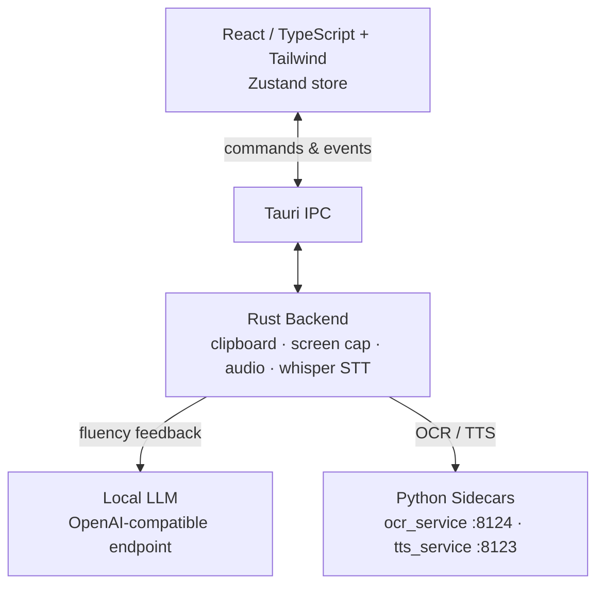
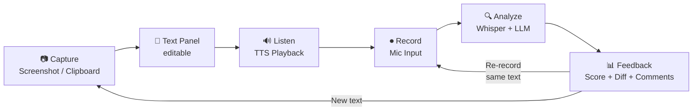
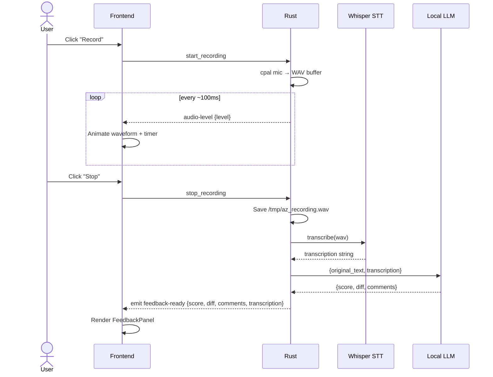

# azReadAnalyzer — Design Spec

**Date:** 2026-06-07  
**Status:** Approved

---

## Overview

azReadAnalyzer is a macOS desktop app for English speaking practice. The user captures text (via screenshot OCR or clipboard paste), listens to it read aloud by TTS, records themselves reading it, and receives AI-powered feedback comparing their recording to the original text.

**Target user:** Chinese native speaker practicing English fluency — pronunciation, word endings, adverb forms, pacing.

**Use cases:** Language learning, presentation rehearsal, reading fluency practice.

**Privacy:** 100% on-device. No audio or text leaves the machine.

---

## Architecture

**Stack:** Tauri 2 (same as MeetBuddy) — Rust backend + React/TypeScript frontend.

```
┌─────────────────────────────────────────────────────────────┐
│  Tauri 2 App Window (always-on-top, resizable)              │
│                                                             │
│  React/TypeScript + Tailwind (azVoiceAssist color theme)    │
│  Zustand store  ←→  Tauri IPC  ←→  Rust backend             │
└─────────────────────────────────────────────────────────────┘
         │                              │
         │                     ┌────────┴────────┐
         │                     │   Rust modules  │
         │                     │  • clipboard    │
         │                     │  • screen cap   │
         │                     │  • audio (cpal) │
         │                     │  • whisper STT  │
         │                     └────────┬────────┘
         │                              │
    ┌────┴────┐                ┌────────┴────────┐
    │  Local  │                │  Python sidecars│
    │  LLM    │                │  • ocr_service  │
    │  (OAI-  │                │  • tts_service  │
    │  compat)│                │  (Qwen3-TTS)    │
    └─────────┘                └─────────────────┘
```



### Sidecars

| Sidecar | Language | Purpose |
|---------|----------|---------|
| `tts_service/` | Python | Qwen3-TTS — text-to-speech playback (reused from azVoiceAssist) |
| `ocr_service/` | Python | macOS Vision framework via PyObjC — OCR on screenshots |

### Local LLM
OpenAI-compatible endpoint (same env vars as azVoiceAssist: `OMLX_BASE_URL`, `OMLX_API_KEY`, `OMLX_MODEL`) — used for fluency feedback comparing original text vs Whisper transcription of user's recording.

---

## Core User Flow

```
1. CAPTURE   Screenshot region (OCR) OR paste clipboard → editable text panel
2. LISTEN    Click "Read Aloud" → TTS reads text at selected speed (0.75x–2x)
3. RECORD    Click "Record" → mic captures user reading → waveform + timer shown
4. ANALYZE   Stop recording → Whisper transcribes → LLM compares to original
5. FEEDBACK  Diff view (original vs transcription) + fluency score (0–100) + LLM comments
6. REPEAT    Re-record same text OR capture new text
```



Each session is one **practice round**. The user can re-record the same text as many times as they want before moving to new content.

---

## UI Layout

Two-panel split (50/50, resizable):

```
┌─────────────────────────────────────────────────────────────────┐
│  [● ● ●]           azReadAnalyzer          [Always on top  ●]   │
├──────────────────────────────┬──────────────────────────────────┤
│  TEXT INPUT                  │  LISTEN                          │
│  ┌──────────────────────┐   │  [▶]  ████░░░░░░░  0:14/0:42 1x  │
│  │  (editable text)     │   ├──────────────────────────────────┤
│  │                      │   │  RECORD YOUR READING             │
│  └──────────────────────┘   │  [⏺]  ~~~~waveform~~~~  00:23   │
│  [Screenshot] [Paste] [Edit] ├──────────────────────────────────┤
│                              │  FEEDBACK                   [87] │
│                              │  original vs yours (diff)        │
│                              │  • missed/wrong  • said  • skip  │
│                              │  LLM comment items               │
│                              │  [Re-record]  [New Text]         │
└──────────────────────────────┴──────────────────────────────────┘
```

**Styling:** azVoiceAssist aesthetic — `#080808` background, frosted glass panels (`backdrop-blur`), indigo accent (`#6366f1` / `#818cf8`), Inter font. Always-on-top toggle in titlebar. Resizable, draggable window.

**Screenshot capture UX:** clicking "Screenshot" hides/minimizes the window → user draws a region using macOS native screenshot tool (`screencapture -i`) → window restores → OCR sidecar extracts text → text populates the input panel.

---

## Components

### Frontend (`src/`)

| Component | Purpose |
|-----------|---------|
| `TextInputPanel` | Editable textarea showing captured/pasted text |
| `CaptureControls` | Screenshot, Paste, Edit buttons |
| `PlaybackControls` | TTS play/pause/stop, progress bar, speed selector |
| `RecordingPanel` | Record/stop button, animated waveform, timer |
| `FeedbackPanel` | Score ring, diff view, LLM comment list, Re-record/New Text buttons |
| `useAppStore` | Zustand store — all app state |
| `useTauriEvents` | Wires Tauri IPC events to store actions |

### Rust backend (`src-tauri/src/`)

| Module | Purpose |
|--------|---------|
| `capture.rs` | Screen region selection + screencapture subprocess + temp image file |
| `clipboard.rs` | Read clipboard text via `arboard` crate |
| `audio.rs` | Mic recording via `cpal` + WAV file output |
| `stt.rs` | Whisper STT on user's recording via `transcribe-rs` (same as MeetBuddy) |
| `llm.rs` | HTTP call to local LLM — diff analysis + fluency scoring |
| `commands.rs` | Tauri IPC commands (capture, paste, play, record, stop, analyze) |
| `events.rs` | Typed events emitted to frontend |

### Python sidecars

**`ocr_service/`**
- Input: image file path (temp PNG from screencapture)
- Uses: `pyobjc-framework-Vision` for macOS Vision OCR
- Output: extracted text string via stdout/HTTP

**`tts_service/`** (reused from azVoiceAssist verbatim)
- Input: text + speed multiplier
- Output: audio playback via Qwen3-TTS

---

## Data Flow

### Screenshot → Text
```
User clicks "Screenshot"
  → Tauri hides window
  → Rust spawns: screencapture -i /tmp/az_capture.png
  → User draws region
  → Rust sends image path to OCR sidecar (HTTP POST)
  → OCR sidecar returns extracted text
  → Tauri emits text-captured event → frontend populates TextInputPanel
  → Tauri restores window
```


### Record → Feedback
```
User clicks "Record"
  → Rust starts cpal mic capture → streams to WAV buffer
  → Frontend shows waveform (audio-level events) + timer
User clicks "Stop"
  → Rust saves WAV file to /tmp/az_recording.wav
  → Rust runs Whisper STT → transcription string
  → Rust calls local LLM: {original_text, transcription} → {score, diff, comments}
  → Tauri emits feedback-ready event → FeedbackPanel renders
```



---

## Tauri IPC Contract

### Commands (frontend → Rust)
| Command | Args | Returns |
|---------|------|---------|
| `capture_screenshot` | — | — (emits `text-captured`) |
| `paste_clipboard` | — | `{text: string}` |
| `play_tts` | `{text, speed}` | — |
| `stop_tts` | — | — |
| `start_recording` | — | — |
| `stop_recording` | — | — (emits `feedback-ready`) |

### Events (Rust → frontend)
| Event | Payload |
|-------|---------|
| `text-captured` | `{text: string}` |
| `audio-level` | `{level: number}` — for waveform |
| `recording-state` | `{state: "idle" \| "recording" \| "analyzing"}` |
| `feedback-ready` | `{score, diff, comments, transcription}` |
| `tts-state` | `{state: "idle" \| "playing", position_ms: number, duration_ms: number}` |

---

## State (Zustand)

```typescript
interface AppState {
  // Text
  inputText: string;
  // TTS
  ttsState: 'idle' | 'playing';
  ttsPositionMs: number;
  ttsDurationMs: number;
  ttsSpeed: number;
  // Recording
  recordingState: 'idle' | 'recording' | 'analyzing';
  audioLevel: number;
  recordingTimer: number;
  // Feedback
  feedback: FeedbackResult | null;
}

interface FeedbackResult {
  score: number;             // 0-100
  transcription: string;
  diff: DiffToken[];         // {text, type: 'correct'|'missed'|'added'|'skipped'}[]
  comments: LLMComment[];    // {icon, text}[]
}
```

---

## Error Handling

| Scenario | Handling |
|----------|---------|
| Screenshot cancelled | Window restores, no text change, silent |
| OCR sidecar unreachable | Toast: "OCR service not running — start ocr_service/" |
| TTS sidecar unreachable | Toast: "TTS service not running — start tts_service/" |
| Clipboard empty/non-text | Toast: "No text in clipboard" |
| Whisper model missing | Modal with download instructions (same pattern as MeetBuddy) |
| LLM endpoint unreachable | Feedback shows transcription only, no score/comments |
| Mic permission denied | Toast with link to System Settings |
| Screen recording permission denied | Toast: "Grant Screen Recording permission in System Settings → Privacy" |

---

## Testing

- **Unit:** Rust modules (`cargo test --lib`) — clipboard reading, diff algorithm, event payload serialization
- **Frontend:** Vitest + React Testing Library — store actions, diff rendering, component states
- **Mock mode:** `VITE_USE_MOCK=true` — simulates all Tauri events for UI-only dev (same pattern as MeetBuddy)
- **Integration:** Manual — full capture→record→feedback round-trip on real hardware

---

## Prerequisites & Setup

```bash
# Same as azVoiceAssist + MeetBuddy
# Node 18+, Rust stable, cmake, Xcode CLI Tools

# OCR sidecar
cd ocr_service && pip install pyobjc-framework-Vision fastapi uvicorn
uvicorn server:app --port 8124

# TTS sidecar (from azVoiceAssist)
cd tts_service && .venv/bin/uvicorn server:app --port 8123

# Whisper model
mkdir -p ~/.azreadanalyzer/models
curl -L -o ~/.azreadanalyzer/models/ggml-base.en.bin \
  https://huggingface.co/ggerganov/whisper.cpp/resolve/main/ggml-base.en.bin

# Env vars (same as azVoiceAssist)
export OMLX_BASE_URL="http://127.0.0.1:8002/v1"
export OMLX_API_KEY="YOUR_KEY"
export OMLX_MODEL="your-model"

# macOS permissions (one-time, grant via Terminal.app on the machine directly)
# - Microphone: triggered on first record
# - Screen Recording: required for screencapture -i (grant in System Settings → Privacy → Screen Recording)

# Run
npx tauri dev
```

---

## Out of Scope (v1)

- Session history / saved recordings
- Multiple language support (English only)
- Pronunciation phoneme-level scoring
- Cloud sync
- Windows / Linux support
